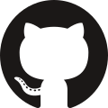

+++
title = "About"
path = "about"
template = "about.html"
+++

# About Me

  
  

Pronouns: she / her

* Software developer that 💜's Rust, Haskell, and learning new languages
* Cares about tech & people
* Enjoys cycling & cross-stitching

## Things I Recommend

* [The Greater Than Code podcast](https://www.greaterthancode.com/)
* [The knurling Sessions microcontroller projects](https://knurling.ferrous-systems.com/sessions/) by [Ferrous Systems](https://ferrous-systems.com/)

## This Blog

* Built using [Zola](https://www.getzola.org/)
* Hosted via [Netlify](https://www.netlify.com/)
